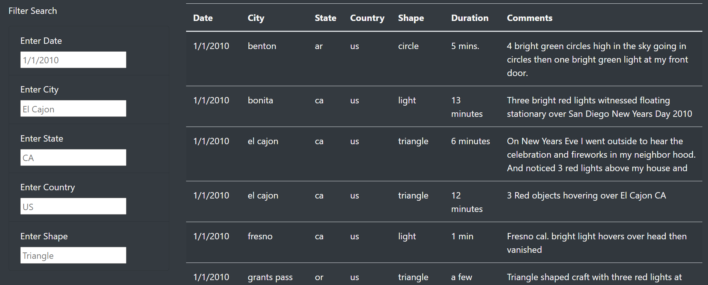
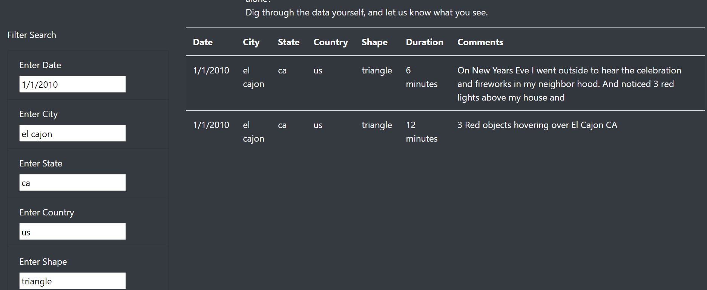

# UFOs

## Overview of the Analysis:

Create a Webpage and dynamic table, provide a more in-depth analysis of UFO sightings by allowing users to filter for multiple criteria at the same time. Using JavaScript and HTML, modify the code in your index.html file to create more table filters. In addition to the date filter you created in this module, add filters for the city, state, country, and shape. Using JavaScript, replace the handleClick() function in app.js file with a new function that saves the element, value, and id of the filter that was changed. Then, create a new function to loop through the dataset and keep only the results that match the search criteria. The webpage will be updated with the search criteria after pressing "Enter".

## Results:

-The list element that creates the button is removed, and there are five list elements for filtering in the index.html file. 

-The event listener is modified to detect changes to each filter in the app.js file.

-The updateFilters() function saves the element, value, and the id of the filter that was changed. 

-The filterTable() function loops through all of the filters and keeps any data that matches the filter values. 

-The webpage filters the table correctly based on user input.

## Summary:

#### Drawback:

-The user must know specific dates, cities, or shapes to search. Some shapes like "light" might not be as intuitive. The filters require correct lower-case spellings and cannot include spaces at the end. The city that was used, for example, could not be typed as "elcajon", “el cajon_”, or "El Cajon". The only acceptable input would be "el cajon".

#### Recommendations:

-The next addition to the filters should be to add a trim function to catch spaces at the end of words as well as allow for upper and lower cases.

-A filter on a date range might be preferable than a singular date. Typing 1/2010 did not bring up all the dates from January as hoped. Perhaps, the UFO Sightings occur more frequently in a specific month instead of a specific day within the month. It is recommended to add in a filter function to include a date range as the filter to aid in the investigation of UFO Sightings.
